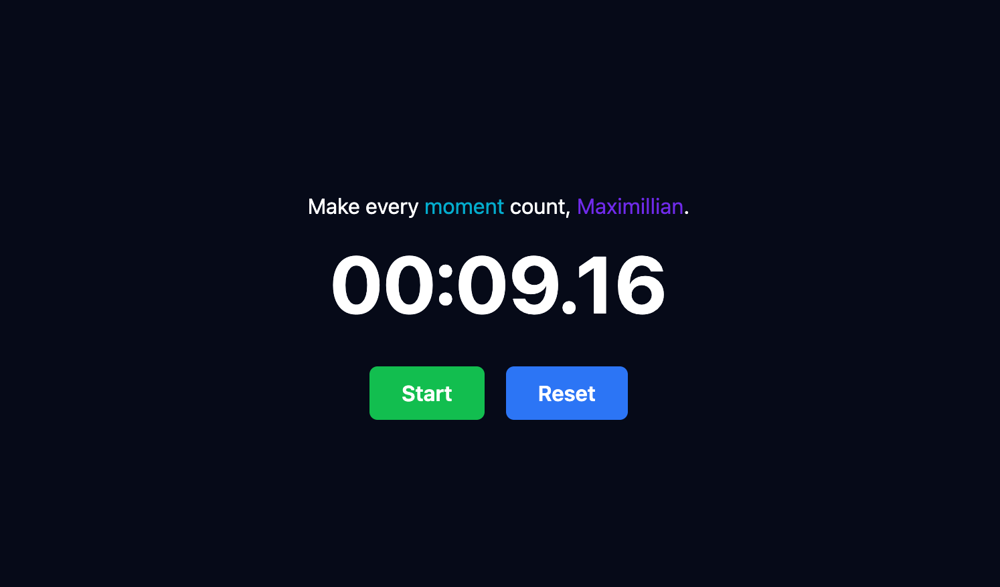

<a href="/" style="text-decoration: none;">
    <h1 style="font-size: 2.2rem; font-weight: bold;">
        se:<span style="color: #7D3BED;">ss</span>:ion - make every <span style="color: #7D3BED;">moment</span> count
    </h1>
</a>

> TLDR: Set a stopwatch for each session, keep a log, and review your progress to improve productivity over time.



> I've built **se:ss:ion** to help track my study and work sessions. I got this idea when my trusty old [Casio F-91W](https://en.wikipedia.org/wiki/Casio_F-91W) which I used for 14 years finally kicked the bucket and I thought of logging my time on online tools but couldn't find one that I liked. Decided to make one on my own as a weekend challenge.

## Feature wishlist (Status)

0. Deploy this webapp - currently it runs just on my local machine xD (IN PROGRESS)
1. Progress Heatmap to track your sessions through months and years to flex (IN PROGRESS)
2. Ability to add tags to your sessions like Work, Study, Brainstorming, etc (IN PROGRESS)
3. Publlic sharable profiles (BACKLOG)
4. More themes (The current two themes are pretty boring) (BACKLOG)

## Features

- **Session Stopwatch**: Start, pause, and reset timers for study/work sessions.
- **Session Logs**: Automatically logs each session's duration for future reference.
- **JWT Authentication**: Secure login and session management with JSON Web Tokens.
- **Responsive UI**: Built using React and Redux for a smooth user experience.
- **Backend API**: Fast and efficient backend powered by Fastify and Node.js.
- **PostgreSQL Database**: Robust and scalable data storage.

## Tech Stack

### Backend

- **Framework**: Node.js with Fastify
- **Database**: PostgreSQL
- **Authentication**: JWT (JSON Web Tokens)

### Frontend

- **Framework**: React
- **State Management**: Redux
- **Styling**: Tailwind CSS

## Installation

### Prerequisites

- Node.js v20+
- PostgreSQL
- npm or yarn
- node version manager - nvm

### Backend Setup

1. Clone the repository:

   ```bash
   git clone ...
   cd ...
   ```

2. Install dependencies:

   ```bash
   nvm use && npm install
   ```

3. Configure environment variables:

   - Create a `.env` file in the `/backend` directory.
   - Add the following variables:

   ```bash
   DB_CONNECTION_STRING=YOUR_POSTGRES_CONNECTION_STRING
   JWT_SECRET=YOUR_JWT_SECRET
   ```

4. Run database migrations:

   ```bash
   npm run migrate
   ```

5. Start the backend server:
   ```bash
   npm run dev
   ```

### Frontend Setup

1. Navigate to the frontend directory:

   ```bash
   cd ../frontend
   ```

2. Install dependencies:

   ```bash
   nvm use && npm install
   ```

3. Start the frontend development server:
   ```bash
   npm run dev
   ```

### Running the App

- The frontend will be generally running on `http://localhost:5173`.
- The backend API will be usually available on `http://localhost:3001`.

## Usage

1. **Sign up/Login**: Use our simple JWT based authentication to create and manage your account.
2. **Start a Session**: Set a stopwatch to track your study or work session.
3. **Session Logs**: View your past sessions to monitor your productivity.

## Contributing, Issues and Feature Requests

Feel free to fork this repository, create a new branch, and submit pull requests. All contributions are welcome!

For Feature Requests, you can open up a new thread on this Repo or add issues.

## License

This project is licensed under the MIT License. See the [LICENSE](LICENSE) file for details.

---

Built over a weekend at [📍 18°40'30.0"N 73°29'10.0"E](https://maps.app.goo.gl/RshGb5oW22jVdBHV8) by [Kapil P Deshmukh](https://www.linkedin.com/in/kapil-d/).
